# Rhasspy_Robot_Control

## Content

* [General](#General)
* [Robot Photos](#Robot)
* [Hardware](#Hardware)
* [Software](#Software)
* [Setup](#Setup)
* [Repository](#Repository)
* [Code](#Code)
* [Demo Videos](#Demo)

## General <a name="General"></a>
    The project is under permanent development so this readme is only a snapshot
    
    This project controls servo motors of a roboter via offline voice control ( rhasspy ).
    It is divided into two parts.
    The main part controls the head.
    
    The other parts are controlling the modules:
    for example the left arm ( it will be realized by a Raspberry pi Zero)
   
<br />
my robot site: https://roboter.mindach.net


## Robot photos <a name="Robot"></a>
* this is the head. It is my development environment for the voice recognition<br /><p align="left">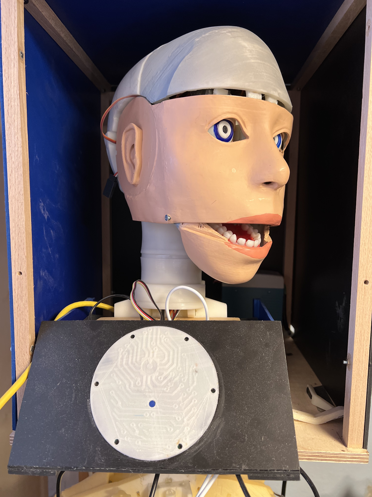</p><br />


## Software
* Raspberryos (opensource)
 <pre><code>https://downloads.raspberrypi.org/raspios_lite_armhf/images/raspios_lite_armhf-2022-04-07/2022-04-04-raspios-bullseye-armhf-lite.img.xz</pre></code><br />
* rhasspy ( offline voice recognition)
* eclipse ide<br />
this is the place i am working with<br /><p align="left">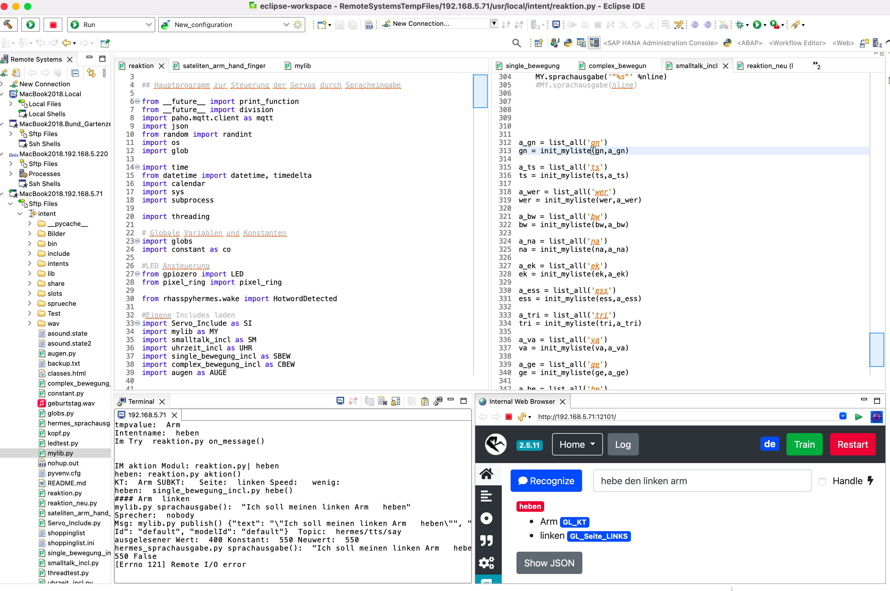</p><br />

**Client Software** <br />
* mqtt explorer <br />

## Hardware <a name="Hardware"></a>
Hardware to buy:<br />
* Raspberry Pi 4 4 GByte RAM short RPi<br /><p align="left">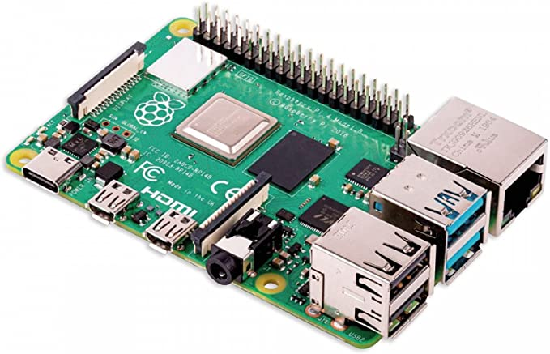</p><br />
* ReSpeaker 6 Mic Array for Raspberry Pi<br /><p align="left">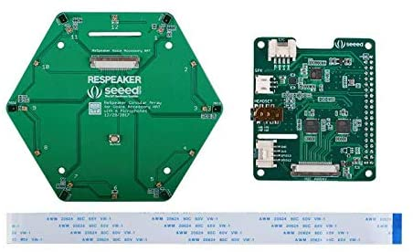</p><br />
* PCA9685 16 Kanal 12 Bit PWM Servo driver for Raspberry Pi<br /><p align="left">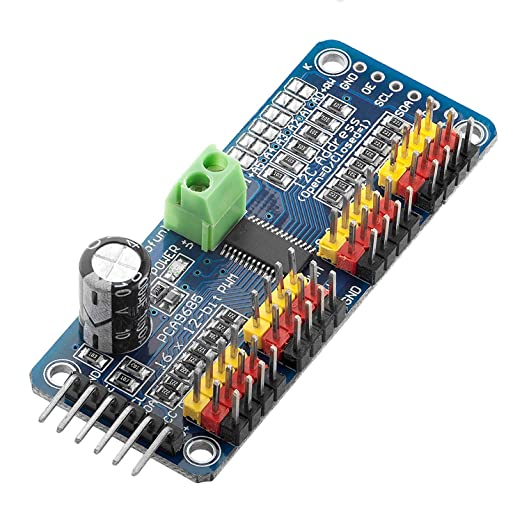</p><br />
* Real Time Clock RTC DS3231 I2C<br /><p align="left">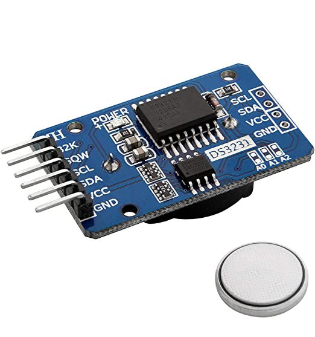</p><br />
* Case with enough space for the HAT<br /><p align="left">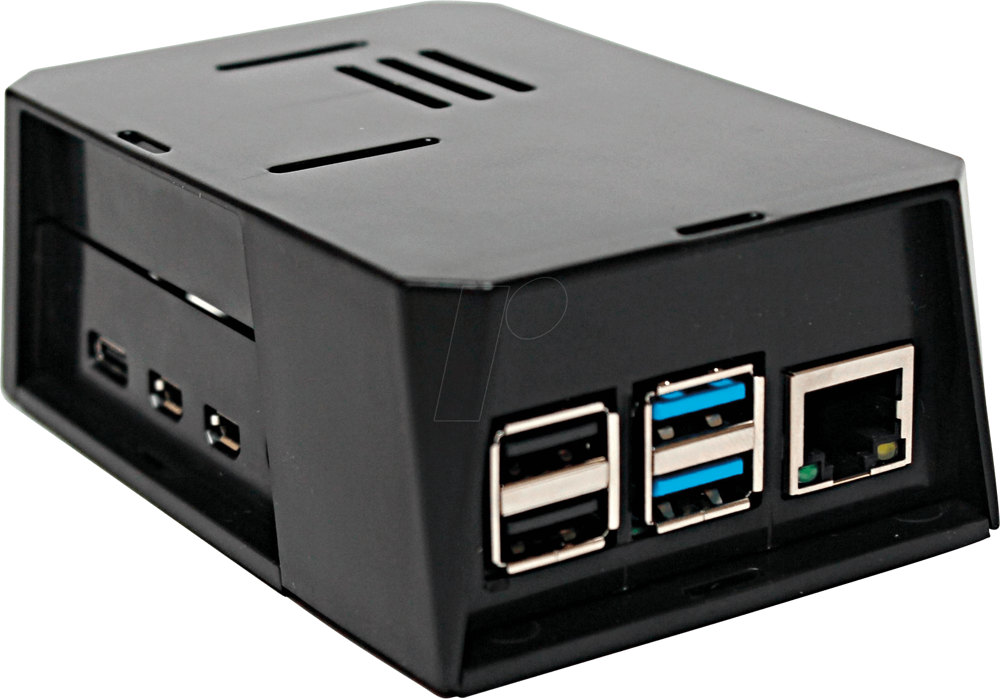</p><br /><br />**this is my case**<br />and the selfmade case for the respeaker microphone extension.<br />you can see the **i2c extender** and the **DS3231** plugged into the **i2c extender**<br /><p align="left">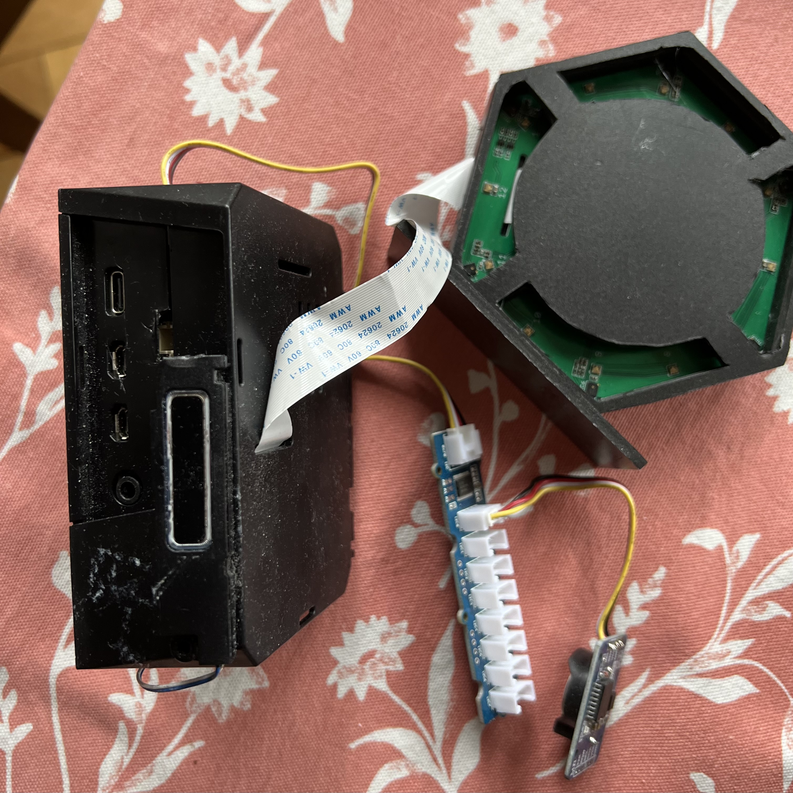</p><br />
<br />

	
## Setup <a name="Setup"></a>
    Set up the  Raspberry Pi's 4 for the offline voice recognition:

**1.** Flash an image to an sd-card <br />
<pre><code>https://downloads.raspberrypi.org/raspios_lite_armhf/images/raspios_lite_armhf-2021-11-08/2021-10-30-raspios-bullseye-armhf-lite.zip</pre></code><br />

- I used  ```Balena Etcher``` on Mac OS.<br /><br />
- Put the SD_Card into the RPI connect a  **HDMI Monitor** and a  **USB-Keyboard** . <br />
- Make a **physical network connection** via ethernet and plug in the power adapter cable. <br />
- After the login prompt is blinking on the monitor, login with the user ```pi```and the password ```raspberry```<br />
- Be careful the keyboard layout is english **z** instead of **y**. <br />
- Give the command  ```sudo passwd``` so the password for the user root can be set <br />
- Execute ```su -``` and the new password to the root user. <br />
- Now change the passord for the user **pi** with ```passwd pi```.

**2.**  Set-up with the command **raspi-config** . <br /><p align="left">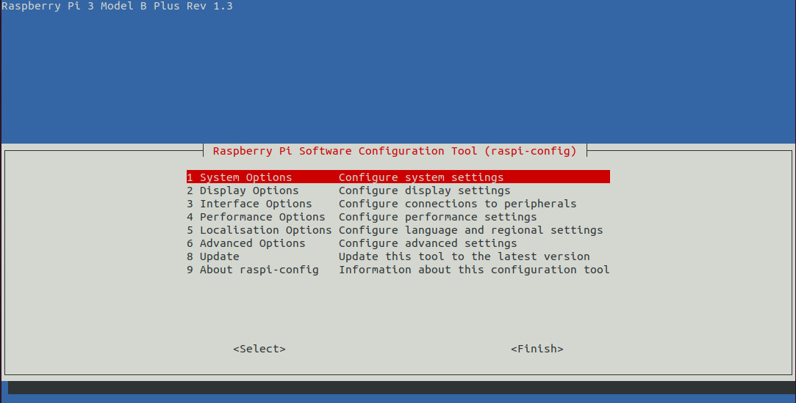</p><br />
* As root user with the command **raspi-config** <br />
* under menu item **3 Interface Options** activate **P2 SSH** and **P5 I2C** .<br /><p align="left">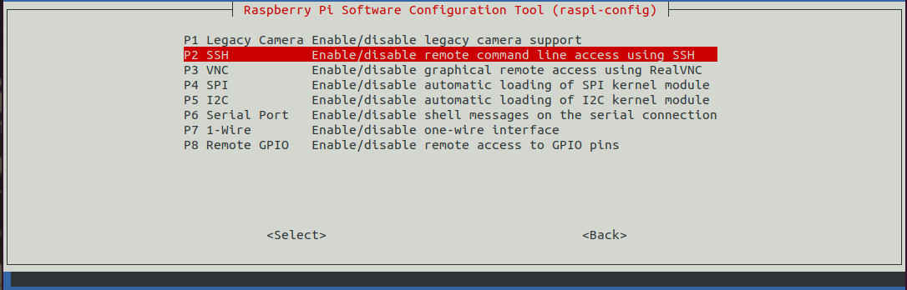</p><br />
* And activate the **localisation** under menu item **5 L1 Locale und L2 Timezone und L3 Keyboard** . <br /><p align="left">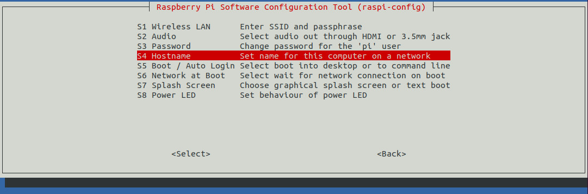</p><br />
- I changed the hostname with this tool to rhasspy. <br />
- Now i adjusted the config file for ssh ```vi /etc/ssh/sshd_config```.<br />
- Change the line with ```PermitRootLogin``` to ```yes```.<br />


**3.**  Make a **new start** of the RPI ( reboot or init6 on the commandline )

**4.**  Login via ssh ```ssh -lroot 192.168.XX.XX```  <br />
* Then type in the commands apt update to update the repository cache and start to install software:<br />
* apt-get install python3-pip git mosquitto mosquitto-clients i2c-tools

**5.** install **Docker** <br />
<br />
* <pre><code>apt-get install apt-transport-https ca-certificates curl gnupg-agent software-properties-common</pre></code>
* <pre><code>curl -fsSL https://download.docker.com/linux/debian/gpg | sudo apt-key add -</pre></code>
* <pre><code>apt-key fingerprint 0EBFCD88</pre></code>
* <pre><code>echo "deb [arch=armhf signed-by=/usr/share/keyrings/docker-archive-keyring.gpg] https://download.docker.com/linux/debian $(lsb_release -cs) stable" | sudo tee /etc/apt/sources.list.d/docker.list > /dev/null</pre></code>
* <pre><code>apt-get update</pre></code>
* <pre><code>apt-get install docker-ce docker-ce-cli containerd.io</pre></code>
* <pre><code>docker run -d -p 12101:12101 --name rhasspy --restart unless-stopped -v "$HOME/.config/rhasspy/profiles:/profiles" -v "/etc/localtime:/etc/localtime:ro" --device /dev/snd:/dev/snd rhasspy/rhasspy --user-profiles /profiles --profile de</pre></code>
**Now the rhasspy needs some configurations**<br />

* change to the folder 

* <pre><code>cd /usr/local</pre></code>
   
* type following command :

* <pre><code>git clone https://github.com/tmgithub/Rhasspy_Robot_Control.git</pre></code>
 
* cd into the new folder

* <pre><code>cd /usr/local/intent. </pre></code>
   

**5.** Install the pythonlibrarys with pip3: <br />
* install the mosquitto tools for the MQtt
* <pre><code>pip3 install paho-mqtt</pre></code> 
* install the connection to GPIO of the Raspberry
* <pre><code>pip3 install gpiozero</pre></code>


**6.** Program as a service start at boottime : <br />
* Change to the folder ```/usr/local/intent``` and execute the command ```python3 -m venv /usr/local/intent```.
* The virtual environment would established.<br />
* In the folder ```/usr/lib/systemd/system``` the file ```reaktion.service``` is copied or generated. <br />
* Tell the daemon with ```systemctl daemon-reload``` about the new file.<br /><br />
* with ```systemctl enable reaktion.service``` the file is ready to be used while system starts.<br />
* ```systemctl start reaktion.service``` will start the service manual. The stopping is with the command ```systemctl stop reaktion.service``` possible.<br />
* You can show the status by typing ```systemctl status reaktion.service```.<br /><br />
* The content of the file```reaktion.service``` :<br /><br />
<pre><code>[Unit]<br />
Description=Robot_Control   #Description of the Service<br />
After=network.target<br />
[Service]<br />
Type=idle *The type idle means the command starts when all other processes are finished. <br />
Restart=on-failure<br />
User=root<br />
ExecStart=/bin/bash -c 'cd /usr/local/intent/ && source bin/activate && python3 reaktion.py' #first cd to the folder<br />
#then the virual env is started<br />
[Install]<br />
WantedBy=multi-user.target</pre></code><br />


**7.** config Rhasspy <br />

* listening to mqtt <br /><p align="left">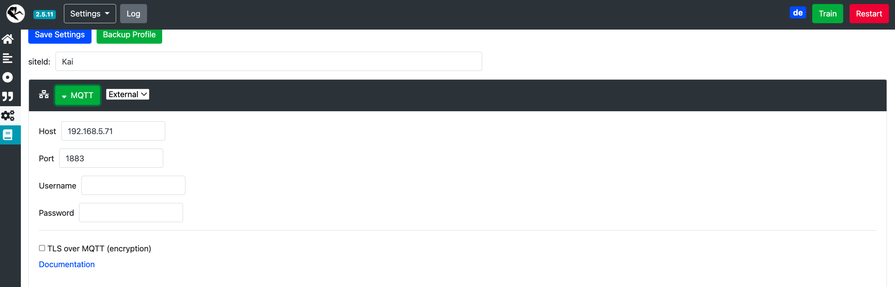</p><br />
* i use pyaudio for recording the voice<br /><p align="left">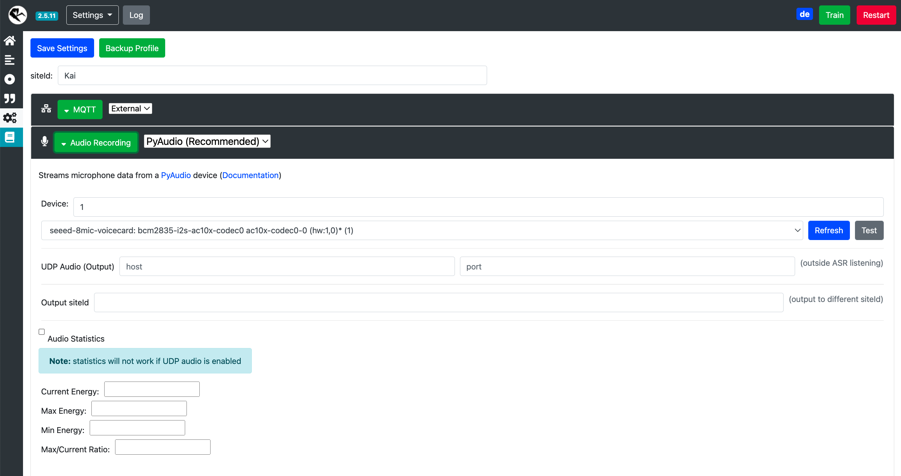</p><br />
* my roboter is named kai<br />
* i use the wakeword engine **Rhasspy Raven** <br /><p align="left">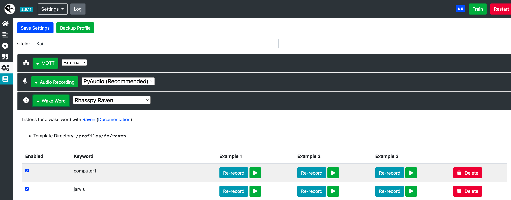</p><br />

* speech to text via kaldi <br /><p align="left">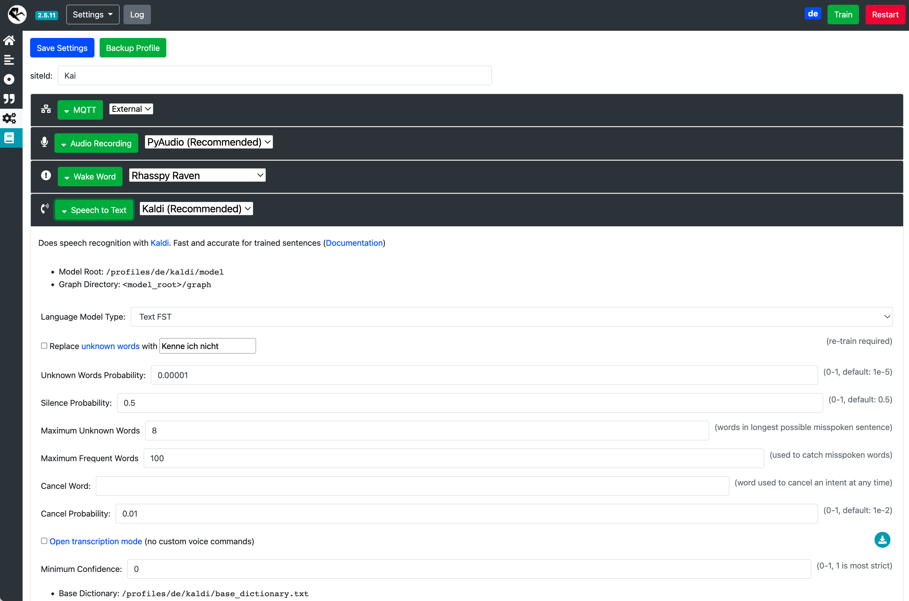</p><br />
* intent recognition via Fsticuffs <br /)<p align="left">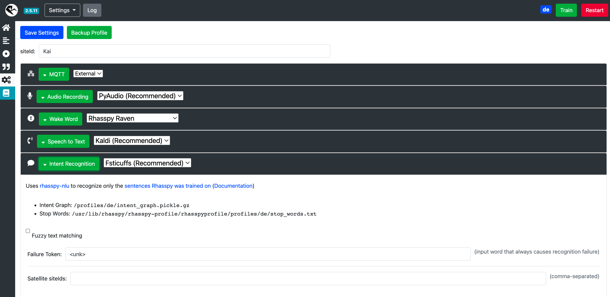</p><br />
* all words were send to mqtt so other programs can listen to them <br /><p align="left">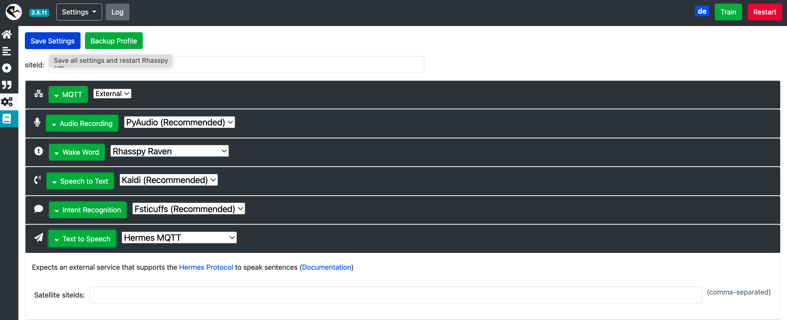</p><br />
* the sound is played by aplay ( for example error sound etc.) <br /><p align="left">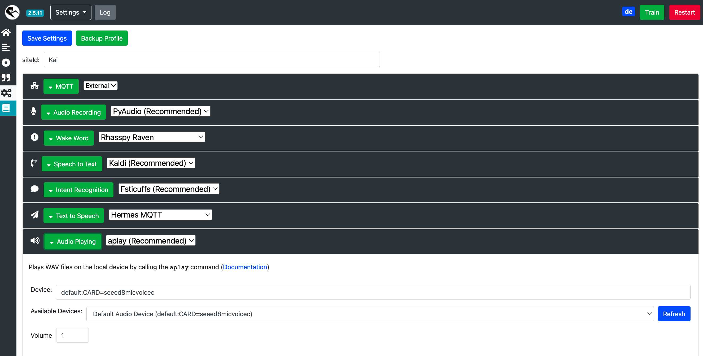</p><br />


## Repository <a name="Repository"></a>

actualize Repository  :<br />
change to folder /usr/local/intent <br />
start the following commands :<br />

```git add -A```<br />
```git commit -m "sync"```<br />
```git pull```<br />
```git push```<br />

the commands  push / pull  needs login.

## Code <a name="Code"></a>

Program Sequence :

The program reaktion.py will be started  with the following command<br />
<br />
```cd /usr/local/intent/; python3 reaktion.py```<br />
<br />
**after loading the libraries** the main program start a subprocess the receiver for mqtt:<br />
        <pre><code>subprocess.Popen(['/usr/bin/python3','/usr/local/intent/hermes_sprachausgabe.py'])<br />
        time.sleep(4)<br />
        globs.initialize() ### Globale Variablen initialisieren<br />
        MY.sound_initialize()</code></pre><br />
**The function on_connect() subscribes to the mqtt**<br />
    <pre><code>def on_connect(client, userdata, flags, rc): ## Mit dem mosquitto verbinden und intent und hotword subscriben<br />
            print('reaktion.py Connected at ',datetime.now())<br />
            mqtt.subscribe('hermes/intent/#')<br />
            mqtt.subscribe('hermes/hotword/#')</code></pre><br />
**at the end of the file reaktion.py**<br />
    <pre><code>mqtt = mqtt.Client()<br /> 
    mqtt.on_connect = on_connect<br />
    mqtt.on_message = on_message<br />
    mqtt.connect('localhost', 1883)<br />
    mqtt.loop_forever()</code></pre><br />
    
## Demo Videos <a name="Demo"></a>
* Some action videos:
* Hand folding mechanism https://youtube.com/shorts/nNETJs56LOI


